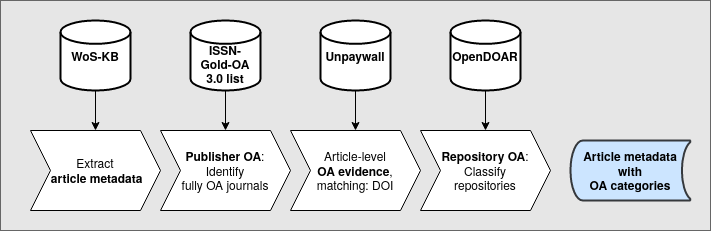

## Introduction
<!-- Anne -->
In 2021 we published a study on the uptake of Open Access (OA) Publishing in the German research landscape, where we investigated the development of the proportions of articles that are openly available on the national level as well as the insitutional level. Special regard was paid to the particular structure of the German research landscape including universities as well as non-university research institutes. Moreover, a systematic classification of distinct categories of OA publishing allows to identify different patterns of adoption to OA (@hobert_open_2021). Details of the data collection and processing can be found in the published paper and in the corresponding [code repository](https://github.com/subugoe/oauni), however, a brief overview is given in the following.

Our study is based on a set of the following publications indexed in the most recent bibliometric database in the WoS instance of the [German Competence Center for bibliometrics](http://www.bibliometrie.info/) (WoS-KB) at the time (namely `wos_b_2019`), which are associated with a German university or non-university research institution:

- Web of Science core collections SCI, SSCI and AHCI
- document types `Article` and `Review`
- publication years 2010 until 2018

To identify German university affiliations in WoS, we used data from the Competence Centre for Bibliometrics, in particular the result of the project “Institutional address disambiguation” @rimmert_2017. Based on disambiguated addresses, this data categorizes the research institution according to Germany’s research landscape.

The general outline of the steps undertaken for gathering the needed information is as follows:

- Extract publications of German institutions
- Identify fully OA journals using the ISSN-Gold-OA list provided by Bielefeld University (@issn-gold-3)
- Collect relevant OA information from Unpaywall (snapshot released February 2020)
- Gather repository information from OpenDOAR (by querying the API in March 2020)
- ISSN to ISSN-L conversion list from [here](http://www.issn.org/wp-content/uploads/2014/03/issnltables.zip) for categorisation of journal-based OA

This is visualised in the following chart (taken from @hobert_open_2021):


For our follow-up study investigating explanatory models that quantify the influence of different discpline-specific and organisational factors on the OA shares of the included institutions, we updated the dataset and extended it to include publications up to publication year 2020. The main reason for this was that we wanted to be able to include (early) effects of recent developments like the transformative agreements negotiated by the DEAL consortium or the removal of Semantic Scholar as a data source from Unpaywall. The updated dataset from 2021 used the same methodology but more recent bibliometric data. More specifically, we now used the bibliometric database `wos_b_2021` of the KB based on Web of Science data, the updated ISSN-Gold-OA list (@issn-gold-4) and the Unpaywall snapshot released in July 2021. Repository data from OpenDOAR was gathered in November 2021.

We start out by comparing some summary statistics of both datasets in order to gain some insights into what quantities were subject to the strongest changes from the first data gathering point of time in mid-2019 to the time of data update in late 2020. Afterwards, we investigate a matched dataset, where we mapped single articles from one dataset to the other via identical UT, the unique Web of Science identifier. In this part of the analysis we focus on changes in the OA category, since this is the field we mainly rely upon in our follow up regression study.

## Descriptive Statistics
<!-- Anne -->
The generation of the datasets we used is documented in the project's [Github repository](https://github.com/subugoe/oauni). Here, we load the data, select relevant information and calculate some high-level descriptive statistics, like, for example, the mean, median and standard deviation of the institutional OA shares.

```{r load_data}
library(tidyverse)
detailed_data_old <- read_csv("data/pubs_cat_details.csv", col_types = "dcccdcddcccllllccccclccclclccccccccccccc")

data_old <- detailed_data_old %>%
  select(UT_EID, PUBYEAR,INST_NAME, sector, upw_matched, oa_category) %>%
  distinct() %>%
  mutate(sector = case_when(
            sector == "Hochschulen" ~ "Universities (UNI)",
            sector == "Helmholtz-Gemeinschaft" ~ "Helmholtz Association (HGF)",
            sector == "Max-Planck-Gesellschaft" ~ "Max Planck Society (MPS)",
            sector == "Leibniz-Gemeinschaft" ~ "Leibniz Association (WGL)",
            sector == "Fraunhofer-Gesellschaft" ~ "Fraunhofer Society (FhS)",
            sector == "Ressortforschung" ~ "Government Research\n Agencies (GRA)"
        ),
        oa_category = factor(
           oa_category,
           levels = c(
              "full_oa_journal",
              "other_oa_journal",
              "opendoar_inst",
              "opendoar_subject",
              "opendoar_other",
              "other_repo",
              "not_oa"
          )
        )
  )

excl_from_analysis <- readr::read_csv("data/exclude_from_analysis.csv")
data_old <- data_old %>%
  anti_join(excl_from_analysis, by = c("INST_NAME" = "Universitäten"))
rm(detailed_data_old)


detailed_data_new <- read_csv("data/pubs_cat_details_new.csv", col_types = "dcccdcddcccllllccccclccclclccccccccccccc")

data_new <- detailed_data_new %>%
  select(UT_EID, PUBYEAR,INST_NAME, sector, upw_matched, oa_category) %>%
  distinct() %>%
  mutate(sector = case_when(
            sector == "Hochschulen" ~ "Universities (UNI)",
            sector == "Helmholtz-Gemeinschaft" ~ "Helmholtz Association (HGF)",
            sector == "Max-Planck-Gesellschaft" ~ "Max Planck Society (MPS)",
            sector == "Leibniz-Gemeinschaft" ~ "Leibniz Association (WGL)",
            sector == "Fraunhofer-Gesellschaft" ~ "Fraunhofer Society (FhS)",
            sector == "Ressortforschung" ~ "Government Research\n Agencies (GRA)"
        ),
        oa_category = factor(
           oa_category,
           levels = c(
              "full_oa_journal",
              "other_oa_journal",
              "opendoar_inst",
              "opendoar_subject",
              "opendoar_other",
              "other_repo",
              "not_oa"
          )
        )
  )

data_new <- data_new %>%
  anti_join(excl_from_analysis, by = c("INST_NAME" = "Universitäten"))
rm(excl_from_analysis)
rm(detailed_data_new)
```

The total number of journal articles increased from `r data_old %>% summarise(n = n_distinct(UT_EID)) %>% .$n` in the original dataset by `r data_new %>% summarise(n = n_distinct(UT_EID)) %>% .$n - data_old %>% summarise(n = n_distinct(UT_EID)) %>% .$n` to `r data_new %>% summarise(n = n_distinct(UT_EID)) %>% .$n` publications in the updated dataset. However, there are almost as many publications (`r data_new %>% filter(PUBYEAR > 2018) %>% summarise(n = n_distinct(UT_EID)) %>% .$n`) in the updated dataset with publication year 2019 or 2020, which were not included in the original dataset. The proportion of articles that were available in OA rose from`r round(data_old %>% mutate(oa_category = fct_collapse(oa_category, not_oa = "not_oa", other_level = "OA")) %>% group_by(oa_category) %>% summarise(n = n_distinct(UT_EID)) %>% mutate(prop = n / sum(n)) %>% filter(oa_category == "OA") %>% .$prop*100, 2)`% to `r round(data_new %>% mutate(oa_category = fct_collapse(oa_category, not_oa = "not_oa", other_level = "OA")) %>% group_by(oa_category) %>% summarise(n = n_distinct(UT_EID)) %>% mutate(prop = n / sum(n)) %>% filter(oa_category == "OA") %>% .$prop*100, 2)`%. Again, this increase is mainly due to articles published after the original data gathering: for the updated dataset, the OA share of articles published in 2018 or earlier is `r round(data_new %>% mutate(is_old = ifelse(PUBYEAR < 2019, TRUE, FALSE), oa_category = fct_collapse(oa_category, not_oa = "not_oa", other_level = "OA")) %>% group_by(is_old) %>% mutate(n_total = n_distinct(UT_EID)) %>% ungroup() %>% group_by(oa_category, is_old, n_total) %>% summarise(n = n_distinct(UT_EID)) %>% mutate(prop = n / n_total) %>% filter(oa_category == "OA", is_old == TRUE) %>% .$prop*100, 2)`%, and the OA share of articles published in 2019 and 2020 is `r round(data_new %>% mutate(is_old = ifelse(PUBYEAR < 2019, TRUE, FALSE), oa_category = fct_collapse(oa_category, not_oa = "not_oa", other_level = "OA")) %>% group_by(is_old) %>% mutate(n_total = n_distinct(UT_EID)) %>% ungroup() %>% group_by(oa_category, is_old, n_total) %>% summarise(n = n_distinct(UT_EID)) %>% mutate(prop = n / n_total) %>% filter(oa_category == "OA", is_old == FALSE) %>% .$prop*100, 2)`%.

We also want to compare oa shares with respect to individual institutions (mean, median, sd), sectors and oa categories.

## Matching procedure
<!-- Nick -->

To analyze the old and new datasets, we first excluded specific institutions and paratexts. Next, we removed fields from the datasets that were not needed for this study. Ultimately, we worked with the `UT_EID`, `sector`, `is_oa`, `oa_status`, `PUBYEAR`, `upw_matched`, and `oa_category` fields. Some of the fields were only present in a nested form. Thus, we flattened the dataset. To do this, we packed multiple rows from the nested field `oa_category` belonging to a `UT_EID` into a single alphabetically sorted list so that each publication made up only one row of the dataset. A new column `set_version` was added to each of the two tables to indicate which dataset a row belonged to. The tables were then matched using the `UT_EID`. From this aggregated table it is now possible to derive information on which `UT_EID`s have been added, which have been removed, which have been changed and which have remained unchanged.

<!--
Beschreibung ZUsammenfügen der DAtensätze, Auswahl Felder, Verkettung oa_category
-->

## Exploration

### Occurances in the data sets
<!-- Nick -->
<!--
How many articles are in both data sets, how many disappeared from the older to the newer version and how many were added?
 -> haben wir hier diejenigen die nur im alten sind genauer angesehen? Man würde ja eigentlich vermuten, dass nur welche dazu kommen.
-->

There are 1077655 publications in the new dataset. This is 254094 more texts than in the old dataset, which consists of 823561 publications. However, 946 texts were also removed from the dataset between 2020 and 2022, which is why a total of 255040 publications were added. It is still unclear why these texts were removed.

### Comparison of OA category
<!-- Nick -->
<!--
Jetzt: nur noch die Artikel, die in beiden enthalten sind.

Wie viele sind identisch und bei wie vielen hat sich matching status (upw_matched) oder oa_category geändert?

Bei denen mit Änderung: welche Änderungen kommen wie häufig vor?
-->

In total, 199737 publications have changed OA categorization. For 622878 texts it has remained the same. For publications where the OA categorization changed, mainly OA categories were removed or one category was exchanged for another. For example, a publication could be assigned only two categories instead of three. Or a publication was no longer assigned `other_repo`, but `opendoar_other`. In Figure x, which represents ..., it can be seen that the categories `opendoar_subject` and `other_repo` were still significantly more common in the old dataset. In contrast, more publications were identified as `opendoar_inst` or `opendoar_other` in the new dataset.

### Investigation of the most notice-able patterns of change in the oa category
<!-- Nick, Anne -->

<!--
1) Genauere Untersuchung der Änderungen bei opendoar_other und opendoar_subject: Um welche Repos handelt es sich hier? Interessant
 sind die Repos, die zu den Veränderungen am meisten beitragen.

 Großer Faktor: arxiv.org war ursprünglich nur disciplinary, jetzt disciplinary und institutionally und damit opendoar_other bei uns -> vielleicht wäre eine Operationalisierung wenn inst und subject, dann wird es bei beidem gezählt besser
 -->

The proportion of publications on disciplinary repositories and repositories that are neither institutional nor disciplinary has significantly reversed compared to the old dataset. While 22605 texts were classified as `opendoar_other` in the old dataset, over 103095 publications were counted as `opendoar_other` in the new dataset. On disciplinary repositories there were 124889 publications in the old dataset. This amount has decreased in the new dataset. As a result, there are only 47789 texts on institutional repositories in the new dataset. This is mainly due to the fact that the arxiv.org repository is no longer classified as a disciplinary repository, but as an `opendoar_other` repository. The service arxiv.org includes over 80000 publications in both datasets.

<!--
 2) Welche(s) Repo(s) führt zur starken Abnahme von other_repo (Hypothese: Semantic scholar)? Semantic Scholar nimmt tatäschlich stark ab, ist aber noch vorhanden (wundert mich, eignetlich sollte es im neuen ausgeschlossen sein?)
 -->

The number of publications that are not in an institutional or disciplinary repository has decreased in the new dataset. In the old dataset, 90454 publications were assigned to the category `other_repo`. In the new dataset, only 19187 texts are counted for this particular category. One reason for this is that publications coming from Semantic Scholar are no longer included in the new dataset. While in the old dataset 81077 publications come from Sematic Scholar, in the new dataset there are only 6852. However, it is unclear why there are still publications from Semantic Scholar in the new dataset at all. Because ???

### Discrepancies in publication year
<!-- Nick, Anne -->
<!--
 Untersuchung der Diskrepanzen im Publikationsjahr: Wie oft tritt das auf? Ist das Jahr im neuen Datensatz älter oder jünger? Welche Publikationsdaten sind bei Crossref für die  zugehörigen dois hinterlegt und korreliert das mit den Daten im neuen/alten Datensatz (zB Datum vom alten stimmt immer mit deposited überein, im neuen mit issued)?
-->

When analyzing changes between the old and new data set, it has been noticed that in a few cases the year of publication was different. In total, this occurred 86 times. Generally, the publication year in the newer data set is more current. A comparison with Crossref, where we matched DOIs of the publications, showed that the publication year in the new dataset is mostly identical to the corresponding field `deposited` in Crossref. The field `deposited` indicates when a publication was last updated. It is unclear why a different publication year was previously specified.

## Summary
<!-- Anne -->
FAzit:
- Kaum Veränderungen bei journal_oa (ist das so?)
- Veränderungen bei Repo hauptsächlich aufgrund der Operationalisierung bzw. Klassifizierung in Originaldaten -> ist zwar identische Vorgehensweise, aber Repodefinitionen haben sich in OpenDOAR geändert bzw. SemanticScholar aus Upw herausgenommen.
