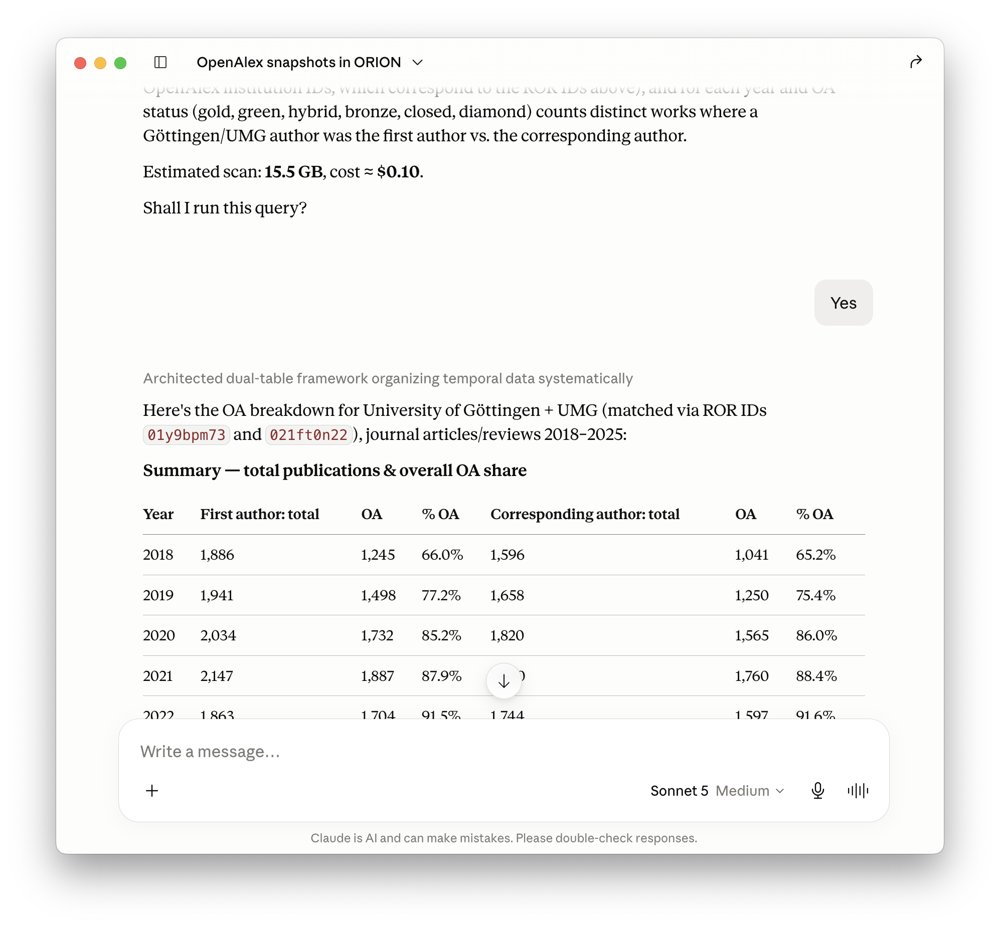
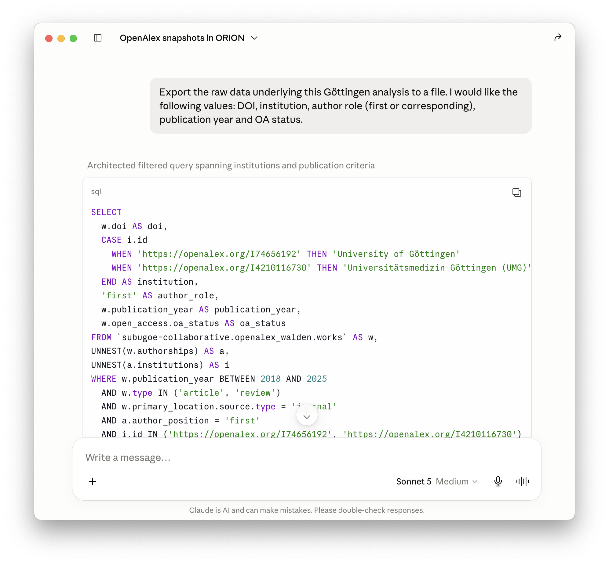
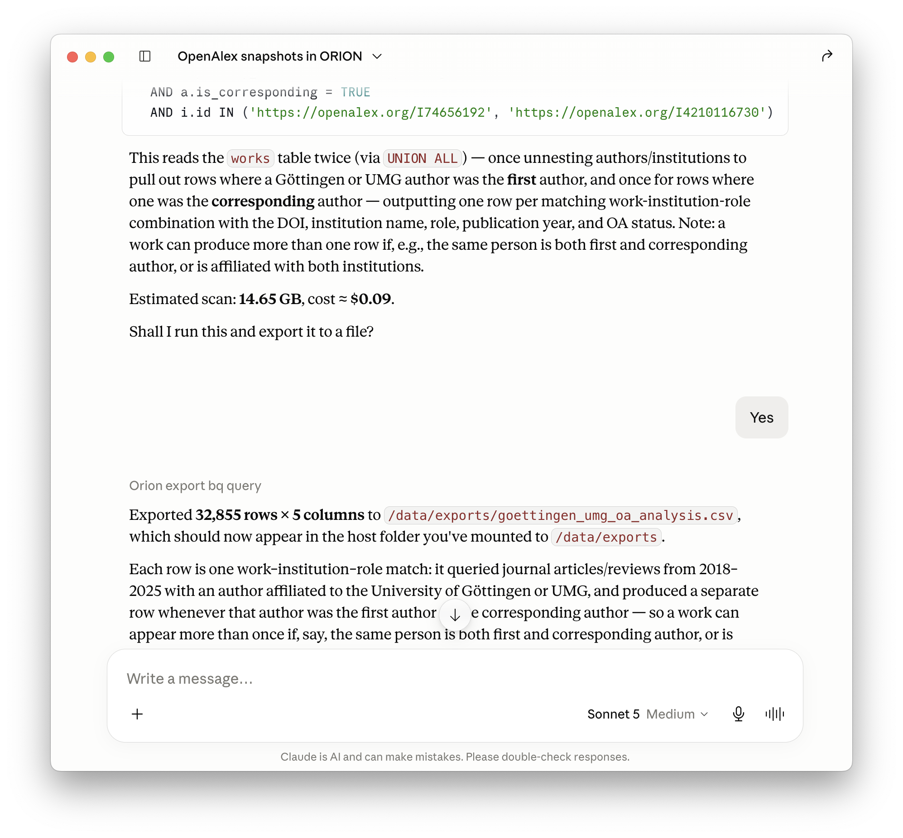

## Introduction

When working with databases provided by the [ORION-DBs collective](https://orion-dbs.community/), I often find it difficult to choose between datasets, understand their schemas, and keep track of changes across releases.
To make these collections discoverable, [ORION-DBs website documents them](https://orion-dbs.community/collections/). Together, ORION-DBs collections span over 20 TB of open research information on Google BigQuery, including different versions of large datasets from Crossref, OpenAlex, and OpenAIRE. 
The website is built from [schema data fetched daily from BigQuery and versioned on GitHub](https://github.com/orion-dbs-community/website/tree/main/data). 
Even with the website, however, finding the right dataset and writing the corresponding SQL query remains difficult, particularly for collections with many table variants or frequent schema changes.

I therefore sometimes feed BigQuery schema files into an LLM to ask questions about the available data sources or to generate or validate SQL queries. [LLMs perform reasonably well at such coding tasks when given sufficient context](https://www.youtube.com/watch?v=owDd1CJ17uQ), and I have found it similarly useful to discuss data analysis design with an LLM directly when providing background information. It is also a quite [cost-sensitive way to deal with data using LLMs](https://www.anthropic.com/engineering/code-execution-with-mcp).

This blog post introduces [`orion-mcp`](https://github.com/subugoe/orion-mcp), an experimental tool that connects ORION-DBs schemas to AI applications such as Claude Desktop, to make this kind of data exploration and retrieval more systematic. `orion-mcp` follows a [growing number of Model Context Protocol (MCP) servers combining scholarly resources with LLMs](https://aarontay.substack.com/p/creating-your-own-research-assistant), many of them offered by commercial vendors and publishers.

`orion-mcp` provides the LLM with enough context to write SQL queries, which are then executed on BigQuery rather than in the conversation. Only the schema and the query results are passed along, which reduces token usage and keeps data retrieval auditable. BigQuery handles the underlying database computation and returns only the results to the model, typically at low cost, allowing retrieval strategies to be discussed and refined in natural language.

This post walks through a use case. The tool is at an early stage, so [feedback is welcome](https://github.com/subugoe/orion-mcp/issues).

## What it does

A typical workflow is to ask which databases are available, explore the relevant schemas, and write a SQL query from that context. Once the results look right, they can be exported for further analysis outside the conversation. I illustrate this below with an open access analysis of publications from authors affiliated with German institutions, and from the University of Göttingen.

The **full Claude chat transcript** can be found here <https://claude.ai/share/ec48f509-78a1-48c9-9f98-98b1c60147ee>.

### Explore schemas

Schema exploration runs on the same metadata that the ORION-DBs website is built from. These schema files are fetched daily from BigQuery and versioned on GitHub. 
The MCP server downloads them when it starts, so browsing schemas requires no Google Cloud account and costs nothing.

In this case, I asked which OpenAlex snapshots ORION-DBs provides and which one is most recent. The model identified the current snapshot and, when I asked it to compare `subugoe-collaborative.openalex_walden` with the one in MultiObs, focusing on the `works` table, it worked through how the two differ in schema design.

### Query BigQuery

This is where authentication with Google Cloud and cost matter. Queries run against your own Google Cloud credentials, and before anything executes, `orion-mcp` estimates the bytes scanned, associated costs, and asks for confirmation.
Here, I asked the model to use the `subugoe-collaborative.openalex_walden` dataset to get the number and proportion of open access articles by year for authors affiliated with German institutions between 2018 and 2025, comparing first and corresponding authors. 

From there, I narrowed the analysis to the University of Göttingen, including UMG, asking the model to use ROR IDs to identify the relevant institutions. Each refinement is a separate query with its own cost estimate fetched from Google BigQuery.

 

When results are returned, follow-up breakdowns and summaries are computed from the R objects held in the local R session.

### Export datasets

Once the results looked right, I asked the model to export the raw data: DOI, institution, author role (first or corresponding), publication year, and OA status.

Exports are written as CSV for flat tabular data, or JSON for nested structures, saved to the mounted exports directory so they appear locally outside the container. he container can only access the two folders you explicitly mount, your Google credentials (read-only) and this exports folder, which prevents access to anything else on the computer.
 

## Costs

The BigQuery side of [this entire use-case session](https://claude.ai/share/ec48f509-78a1-48c9-9f98-98b1c60147ee), five queries plus the export, about 46 GB scanned, cost under \$0.30, and would typically fall within Google BigQuery's free tier of 1 TB per month. Claude usage comes on top. Run against the API with Sonnet, this session would cost roughly another \$0.30–0.50; in Claude Desktop, as here, it is covered by the subscription.

## Installation

Full instructions are in the [GitHub repo README](https://github.com/subugoe/orion-mcp).

The server runs in a Docker container connected to Claude Desktop via its MCP config file. Authentication uses Google's [Application Default Credentials](https://cloud.google.com/docs/authentication/application-default-credentials), so local `gcloud` credentials are used directly and no service account keys are needed. A [Google Cloud account](https://cloud.google.com/free) includes 1 TB of free queries per month.

The tool is implemented in R using [`{mcptools}`](https://posit-dev.github.io/mcptools/) and [`{ellmer}`](https://ellmer.tidyverse.org/), assisted with Claude Code.  It mainly uses [`{bigrquery}`](https://bigrquery.r-dbi.org/) to interact with Google BigQuery, which I use in my everyday work.

Note that I only tested `orion-mcp` using Claude and Claude Desktop. If you find any bugs or have questions, please feel free to file an [issue](https://github.com/subugoe/orion-mcp/issues).

## Responsible use

LLMs make mistakes. Always verify that queries return the results you intended before using them in any analysis. If you plan to use this in a publication, check the outlet's policy on AI-assisted work and document your process accordingly.

