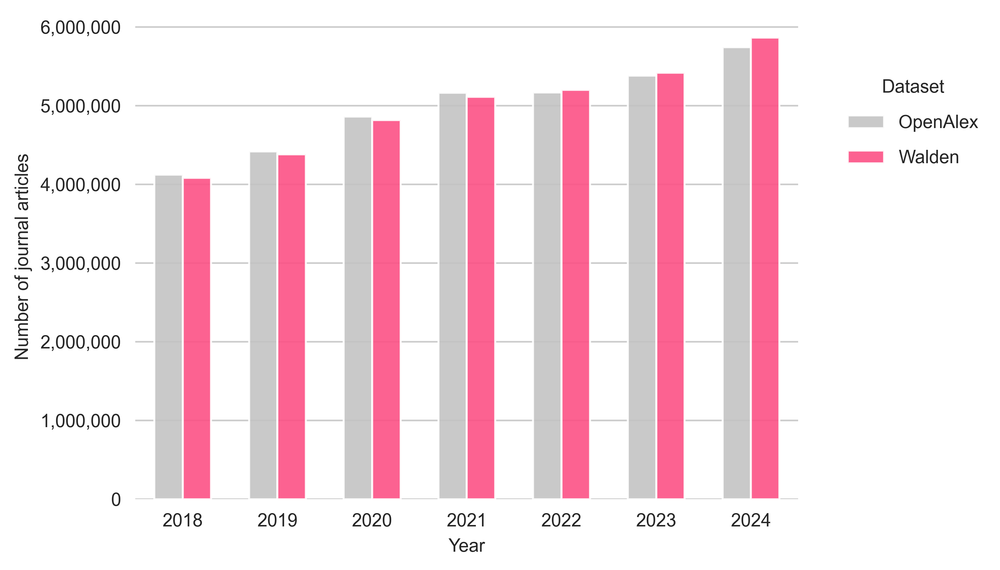
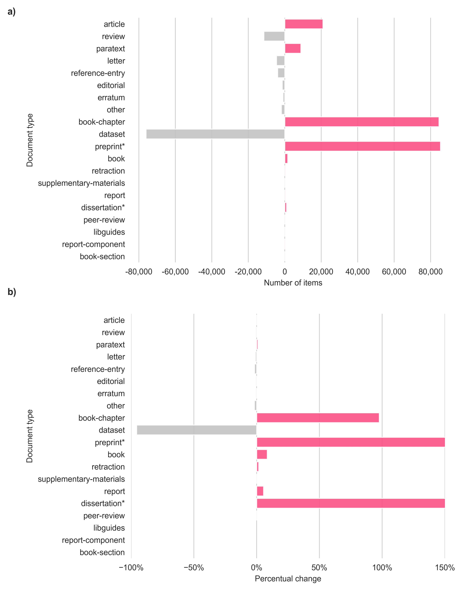
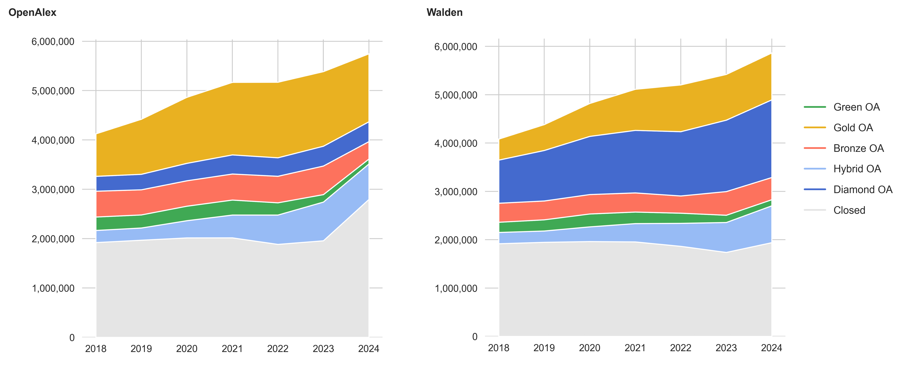
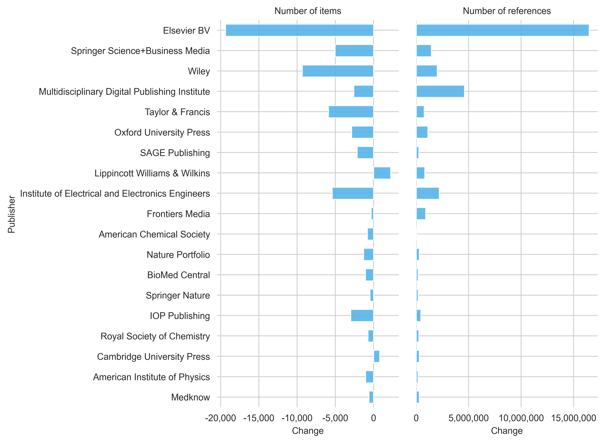

## Introduction

The past few months brought some changes to the OpenAlex data service. The most relevant update happened in November 2025 with the Walden Update, which promised [better reference coverage, improved OA detection and a more extensive database](https://blog.openalex.org/openalex-rewrite-walden-launch/). In January 2026, improved integration of funding information was introduced, along with a new entity called [*Awards*](https://docs.openalex.org/api-entities/awards). At the same time, little is known about the consequences of the changes so far. In December 2025, it was observed that the quality of author affiliations had declined with the Walden update [@jahn2025]. Meanwhile, there have been two further Walden updates (15 January 2026 and 3 February 2026) that address an improvement to the problem. 

In this blog post, I will take a closer look at the changes made in the Walden release. To do this, I will contrast a pre-Walden snapshot from September 2025 with a Walden snapshot from February 2026. The data analysis will cover changes in publication volume, OA status, references, funding information, document types and publication types. The analysis is limited to publications from 2018 and 2024 and to journal articles only.

## Data and Methods

The publicly accessible [scholarly data warehouse](https://subugoe.github.io/scholcomm_analytics/data.html), powered by Google BigQuery and operated by the State and University Library Göttingen, provides access to both an OpenAlex snapshot from September 2025 and the most recent Walden snapshot from February 2026. Access requires a free Google account (Payment information is required, but Google offers the first 1 TB of queries free of charge).

The analysis was carried out by  querying both OpenAlex versions separately and then comparing the results (i.e. no inner join, no shared dataset). This approach is intended to ensure that the new records added to Walden can also be included in the analysis. This is particularly the case for records labelled as [expansion packs](https://docs.openalex.org/how-to-use-the-api/xpac) (which have an is_xpac=True in the data). The following analysis indicates whether or not the expansion pack is included in a query. 

<details>
  <summary>Python code for setup</summary>
  
```python
from google.cloud import bigquery
import pandas as pd
import matplotlib.pyplot as plt
import seaborn as sns
import numpy as np
from matplotlib.lines import Line2D
import matplotlib.ticker as mtick
import matplotlib.image as mpimg

client = bigquery.Client(project='subugoe-collaborative')

openalex_snapshot = 'subugoe-collaborative.openalex.works'
walden_snapshot = 'subugoe-collaborative.openalex_walden.works'

sns.set_style('whitegrid')
plt.rc('font', family='Arial')
plt.rc('font', size=9) 
plt.rc('axes', titlesize=9) 
plt.rc('axes', labelsize=9) 
plt.rc('xtick', labelsize=9) 
plt.rc('ytick', labelsize=9) 
plt.rc('legend', fontsize=9)

def calculate_changes(df1_openalex, df2_walden, on):
    changes = pd.merge(df1_openalex, df2_walden, on=on, how='outer', suffixes=('_openalex', '_walden'))

    changes['n_openalex'] = changes['n_openalex'].fillna(0)
    changes['n_walden'] = changes['n_walden'].fillna(0)
    changes = changes[[on, 'n_openalex', 'n_walden']]

    changes['change'] = changes['n_walden'] - changes['n_openalex']
    changes['pct_change'] = (changes['n_walden'] - changes['n_openalex']) / changes['n_openalex'] * 100

    return changes
```
  
</details>

## Results

### Publication volume
Let's start by comparing the number of journal articles between OpenAlex (shown in grey) and Walden (shown in pink) for the publication years 2018 to 2024 (see @fig-publication-volume). A record is considered a journal article if it is assigned to the source type *journal* and the item type *article* or *review*. 

In total, OpenAlex counts 34,884,266 records, while the Walden snapshot counts 34,893,901 records. When looking at individual publication years, it can be seen that the number of journal articles in the Walden snapshot is slightly lower than in the Septmeber 2025 snapshot for the publication years 2018 to 2021 (around -1% per year). From 2022 onwards, the number of articles in the Walden snapshot increases, with the difference being +0,6% (for 2022 and 2023) and +2% (for 2024).

::: cell
{#fig-publication-volume width=80%}
:::

<details>
  <summary>SQL code</summary>
  
```sql
-- oal_by_types
SELECT COUNT(DISTINCT(doi)) AS n, publication_year
FROM `subugoe-collaborative.openalex.works`
WHERE primary_location.source.type = 'journal' AND publication_year BETWEEN 2018 AND 2024 AND (type = 'article' OR type = 'review')
GROUP BY publication_year
ORDER BY publication_year DESC

-- walden_by_types
SELECT COUNT(DISTINCT(doi)) AS n, publication_year
FROM `subugoe-collaborative.openalex_walden.works`
WHERE primary_location.source.type = 'journal' AND publication_year BETWEEN 2018 AND 2024 AND (type = 'article' OR type = 'review')
GROUP BY publication_year
ORDER BY publication_year DESC
```
  
</details>

<details>
  <summary>Python code</summary>
  
```python
calculate_changes(oal_by_pubyear, walden_by_pubyear, on='publication_year').sort_values(by=['change'], ascending=False)

oal_by_pubyear['dataset'] = 'OpenAlex'
walden_by_pubyear['dataset'] = 'Walden'

fig, ax = plt.subplots(figsize=(7,4))
plt.box(False)

sns.barplot(data=pd.concat([oal_by_pubyear, walden_by_pubyear], ignore_index=True),
             x='publication_year',
             y='n',
             palette=['#c3c3c3', '#fc5185'],
             hue='dataset',
             width=0.6,
             saturation=1,
             alpha=0.9,
             zorder=3,
             errorbar=None,
             ax=ax)

ax.yaxis.set_major_formatter(mtick.StrMethodFormatter('{x:,.0f}'))

ax.grid(False, which='both', axis='x')

ax.set(xlabel='Year', ylabel='Number of journal articles')

ax.legend(bbox_to_anchor=(1.05, 0.9),
          frameon=False,
          title='Dataset',
          labelspacing=1.0)

plt.tight_layout()

plt.show()
fig.savefig('media/blog_post_pubyear.png', format='png', bbox_inches='tight', dpi=500)
```
  
</details>

<details>
  <summary>Data</summary>
  
|   publication_year |   n_openalex |   n_walden |   change |   pct_change |
|--------------------|--------------|------------|----------|--------------|
|               2024 |      5747463 |    5866769 |   119306 |     2.0758   |
|               2023 |      5385802 |    5421376 |    35574 |     0.660514 |
|               2022 |      5170934 |    5204308 |    33374 |     0.645415 |
|               2021 |      5168607 |    5113724 |   -54883 |    -1.06185  |
|               2020 |      4865503 |    4820914 |   -44589 |    -0.916431 |
|               2019 |      4421064 |    4383193 |   -37871 |    -0.856604 |
|               2018 |      4124893 |    4083617 |   -41276 |    -1.00066  |
  
</details>

### Publication types

To better understand the changes in the Walden snapshot, it makes sense to take a step back and look at the distribution of publication types in both snapshots. 


| source_type    |   n_openalex |   n_walden |   change |   pct_change |   openalex_share |   walden_share |
|:---------------|-------------:|-----------:|---------:|-------------:|-----------------:|---------------:|
| journal        |     37,162,915 |   37,265,545 |   102,630 |     0.28% |     61.44%      |   34.85%       |
| repository     |      7,095,230 |   43,716,031 | 36,620,801 |   516.13%    |     11.73%      |   40.88%      |
| None           |      6,908,023 |   13,455,640 |  6,547,617 |    94.78%   |     11.42%      |   12.58%       |
| ebook platform |      6,502,127 |    3,930,549 | -2,571,578 |   -39.55%   |     10.75%      |    3.68%    |
| book series    |      1,488,834 |    1,478,195 |   -10,639 |    -0.71% |      2.46%    |    1.38%     |
| conference     |      1,331,331 |     768,789 |  -562,542 |   -42.25%   |      2.2%     |    0.72%    |
| other          |           97 |        187 |       90 |    92.78%   |      0% |    0% |
| igsnCatalog    |            0 |    6,328,178 |  6,328,178 |   inf        |      0%           |    5.92%    |
| metadata       |            0 |        270 |      270 |   inf        |      0%          |    0%  |
| raidRegistry   |            0 |          4 |        4 |   inf        |      0%           |    0%  |

: Changes in publication types {.striped .hover}

<p></p>

Here we can see that the publication type *journal* has a relatively small increase (+0.28%) compared to other source types such as *repository* (+516%). Based on their respective share in the snapshot, records with the source type *journal* account for approximately 61% of the records in the September snapshot and only 35% in the Walden snapshot. This is partly due to an increase in items with the source type *igsnCatalog* and records without an assigned source type (and of course, records from repositories).

<details>
  <summary>SQL code</summary>
  
```sql
SELECT COUNT(DISTINCT(doi)) AS n, primary_location.source.type AS source_type
FROM {snapshot}
WHERE publication_year BETWEEN 2018 AND 2024
GROUP BY source_type
ORDER BY n DESC
```
  
</details>

### Document types

Next, we look at the distribution of document types in both snapshots (see @fig-document-types). Please note, that records have been restricted to the source type *journal* again.

We can see that the number of records with the document types *article*, *paratext*, *book-chapter* and *preprint* have increased in the latest Walden snapshot. However, in relative terms, the increase in journal articles is very limited (only 0.06%). With an increase of over 100%, *preprints* and *dissertations* have seen the highest rise (relatively speaking). Records with the document type *dataset*, in contrast, have been classified less frequently in the recent snapshot (about 76,000 records less). 

::: cell

{#fig-document-types width=80%}
:::

<details>
  <summary>SQL code</summary>
  
```sql
SELECT COUNT(DISTINCT(doi)) AS n, type
FROM {snapshot}
WHERE primary_location.source.type = 'journal' AND publication_year BETWEEN 2018 AND 2024
GROUP BY type
ORDER BY n DESC
```
  
</details>

<details>
  <summary>Python code</summary>
  
```python
types_plot = calculate_changes(oal_by_types, walden_by_types, on='type')

types_plot['n_openalex_total'] = types_plot['n_openalex'].sum()
types_plot['openalex_share'] = types_plot['n_openalex'] / types_plot['n_openalex_total'] * 100

types_plot['n_walden_total'] = types_plot['n_walden'].sum()
types_plot['walden_share'] = types_plot['n_walden'] / types_plot['n_walden_total'] * 100

types_plot.replace(to_replace='preprint', value='preprint*', inplace=True)
types_plot.replace(to_replace='dissertation', value='dissertation*', inplace=True)

change_color = ['#c3c3c3' if (x < 0) else '#fc5185' for x in types_plot.change]

fig, ax = plt.subplots(figsize=(7,4.5))
plt.box(False)

sns.barplot(data=types_plot, 
            x='change', 
            y='type', 
            orient='h',
            saturation=1,
            palette=change_color,
            hue='type',
            alpha=0.9,
            zorder=3,
            errorbar=None,)

ax.xaxis.set_major_formatter(mtick.StrMethodFormatter('{x:,.0f}'))

ax.set(xlabel='Number of items', ylabel='Document type')

plt.tight_layout()

plt.show()
fig.savefig('media/blog_post_document_types_changes.png', format='png', bbox_inches='tight', dpi=500)

fig, ax = plt.subplots(figsize=(7,4.5))
plt.box(False)

sns.barplot(data=types_plot, 
            x='pct_change', 
            y='type', 
            orient='h',
            saturation=1,
            palette=change_color,
            hue='type',
            alpha=0.9,
            zorder=3,
            errorbar=None,)

ax.xaxis.set_major_formatter(mtick.PercentFormatter(100))

ax.set_xlim(-100, 150)
ax.set(xlabel='Percentual change', ylabel='Document type')

plt.tight_layout()

plt.show()
fig.savefig('media/blog_post_document_types_pct_changes.png', format='png', bbox_inches='tight', dpi=500)

fig, axs = plt.subplots(2, 1, figsize=(10, 10))
filelist =  ['blog_post_document_types_changes', 'blog_post_document_types_pct_changes']
for i, (ax, file) in enumerate(zip(axs.flat, filelist)):
    ax.set_axis_off()
    filename = 'media/' + file + '.png'
    ax.imshow(mpimg.imread(filename), extent=None)
plt.subplots_adjust(wspace=0, hspace=0.05)
plt.text(-100, -2300, 'a)', size=9, weight='bold')
plt.text(-100, -100, 'b)', size=9, weight='bold')
plt.show()
fig.savefig('media/blog_post_figure1.png', format='png', bbox_inches='tight', dpi=500)
```
  
</details>

### Open Access

Major changes are also noticeable in terms of the classification of open access between both snapshots. For example, Diamond OA is far more pronounced in the Walden snapshot than in the September Snapshot, with over 6,3 million more records classified (+249%). Journal articles classified as Gold OA, conversely, are dropping notably, by about 41.5%. Hybrid OA falls by 11.6% overall and Bronze OA by 18.6%. The proportion of Green OA in the Walden snapshot decreased by 12% and the proportion of non-accessible items (closed) declined by 8%.

::: cell

{#fig-open-access}
:::

<details>
  <summary>SQL code</summary>
  
```sql
SELECT COUNT(DISTINCT(doi)) AS n, open_access.oa_status, publication_year
FROM {snapshot}
WHERE primary_location.source.type = 'journal' AND publication_year BETWEEN 2018 AND 2024 AND (type = 'article' OR type = 'review')
GROUP BY oa_status, publication_year
ORDER BY n DESC
```
  
</details>

<details>
  <summary>Data</summary>
  
| oa_status   |   n_openalex |   n_walden |   change |   pct_change |
|:------------|-------------:|-----------:|---------:|-------------:|
| bronze      |      3543148 |    2885111 |  -658037 |    -18.5721  |
| closed      |     14565362 |   13328327 | -1237035 |     -8.49299 |
| diamond     |      2534510 |    8849415 |  6314905 |    249.157   |
| gold        |      9204670 |    5387616 | -3817054 |    -41.4687  |
| green       |      1635056 |    1435499 |  -199557 |    -12.2049  |
| hybrid      |      3401545 |    3008268 |  -393277 |    -11.5617  |
  
</details>

### References

::: cell

{#fig-references width=80%}
:::

<details>
  <summary>SQL code</summary>
  
```sql
SELECT COUNT(DISTINCT(doi)) AS n, primary_location.source.host_organization_name
FROM {snapshot}
WHERE primary_location.source.type = 'journal' AND publication_year BETWEEN 2018 AND 2024 AND (type = 'article' OR type = 'review')
GROUP BY host_organization_name
ORDER BY n DESC
```
  
</details>

### Funding information

## How do these findings affect working with OpenAlex

## Problems with the Walden snapshot

- Reviews were not classified correctly in latest snapshots
- Data additions without prior announcement (manifest changed on AWS)