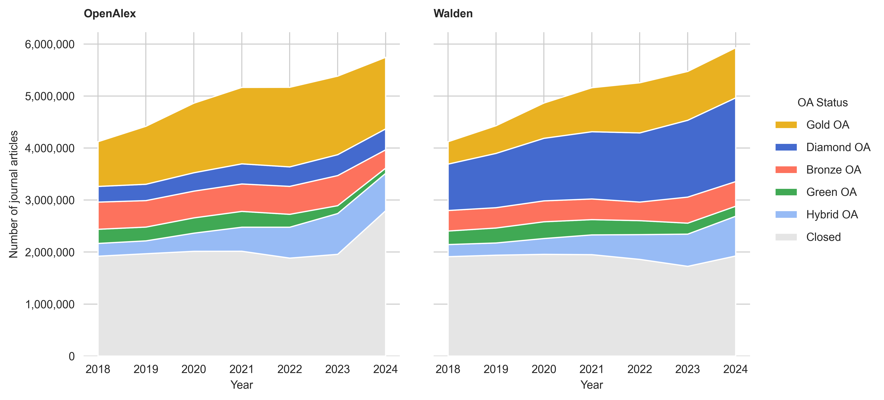
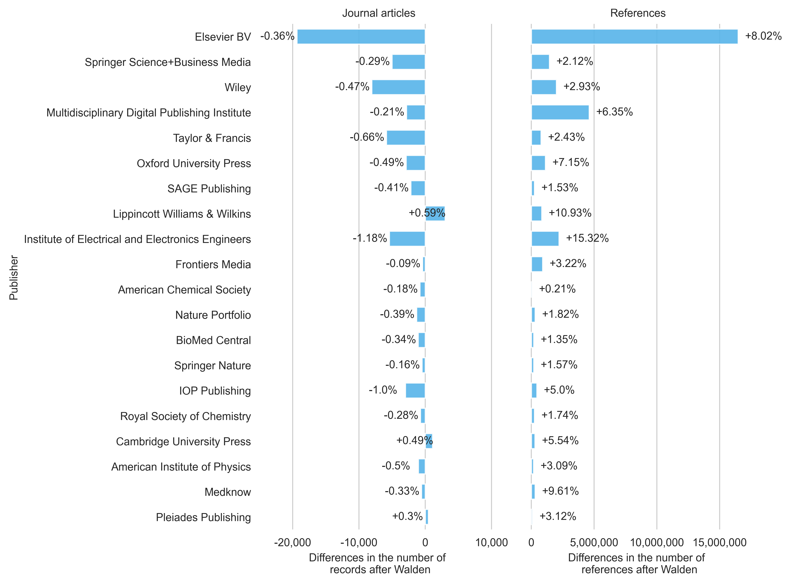
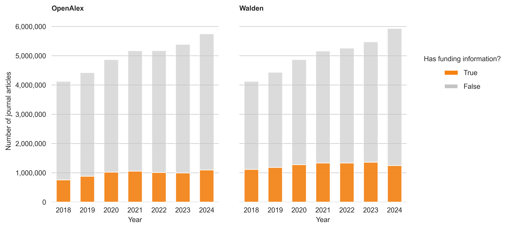

## Introduction

The past few months brought some changes to OpenAlex. The most relevant update happened in November 2025 with the Walden Update, which featured [better reference coverage, improved OA detection and a more extensive database](https://blog.openalex.org/openalex-rewrite-walden-launch/). In January 2026, improved integration of funding information was introduced, along with a new entity called [*Awards*](https://docs.openalex.org/api-entities/awards). 
At the same time, users started reporting issues related to the updates, resulting in further Walden updates on 15 January, 3 February and 25 February 2026. These ongoing issue reports highlight that more and more researchers and institutions have begun to use OpenAlex, making close monitoring of updates all the more important to help users adapt their workflows and identify potential issues early on.

In this blog post, I will take a closer look at the changes made in the Walden release. To do this, I will contrast a pre-Walden snapshot from September 2025 with a Walden snapshot from February 2026 (2026-02-25). The data analysis will cover changes in publication volume, OA status, references, funding information, document types and publication types. The analysis is limited to publications between 2018 and 2024 and focuses on journal articles.

## Data and Methods

The publicly accessible [scholarly data warehouse](https://subugoe.github.io/scholcomm_analytics/data.html), powered by Google BigQuery and operated by the Göttingen State and University Library, provides access to both an OpenAlex snapshot from September 2025 and the most recent Walden snapshot from February 2026. 

The analysis was carried out by  querying both OpenAlex versions separately and then comparing the results (i.e. no inner join, no shared dataset). This approach is intended to ensure that the new records added to Walden can also be included in the analysis. This is particularly the case for records labelled as [expansion packs](https://docs.openalex.org/how-to-use-the-api/xpac) (which have an is_xpac=True in the data). The following analysis does not exclude retractions ([is_retracted](https://docs.openalex.org/api-entities/works/work-object#is_retracted)), paratexts ([is_paratext](https://docs.openalex.org/api-entities/works/work-object#is_paratext)) and the expansion pack ([is_xpac](https://docs.openalex.org/api-entities/works/work-object#is_xpac)). Usually, OpenAlex classifies records labelled with is_paratext=True as paratexts. However, there may occasionally be discrepancies, resulting in a record labelled is_paratext=True being classified as a normal article.

The analysis was conducted in Python. If you are interested in reproducing a figure, you may click on one of the grey arrows below to view my Python code, which was used to run the data analysis and generate the figures.

<details>
  <summary>Python code for setup</summary>
  
```python
from google.cloud import bigquery
import pandas as pd
import matplotlib.pyplot as plt
import seaborn as sns
import numpy as np
from matplotlib.lines import Line2D
from matplotlib.patches import Patch
import matplotlib.ticker as mtick
import matplotlib.image as mpimg

client = bigquery.Client(project='subugoe-collaborative')

openalex_snapshot = 'subugoe-collaborative.openalex.works'
walden_snapshot = 'subugoe-collaborative.openalex_walden.works'

sns.set_style('whitegrid')
plt.rc('font', family='Arial')
plt.rc('font', size=9) 
plt.rc('axes', titlesize=9) 
plt.rc('axes', labelsize=9) 
plt.rc('xtick', labelsize=9) 
plt.rc('ytick', labelsize=9) 
plt.rc('legend', fontsize=9)

def calculate_changes(df1_openalex, df2_walden, on):
    changes = pd.merge(df1_openalex, df2_walden, on=on, how='outer', suffixes=('_openalex', '_walden'))

    changes['n_openalex'] = changes['n_openalex'].fillna(0)
    changes['n_walden'] = changes['n_walden'].fillna(0)
    changes = changes[[on, 'n_openalex', 'n_walden']]

    changes['change'] = changes['n_walden'] - changes['n_openalex']
    changes['pct_change'] = (changes['n_walden'] - changes['n_openalex']) / changes['n_openalex'] * 100

    return changes
```
  
</details>

## Results

### Publication types

Let's start by comparing the distribution of publication types between OpenAlex and Walden for the publication years 2018 to 2024. Here, we can see that the publication type *journal* has a relatively small increase (+1.25%) compared to other source types such as *repository* (+540%). Based on their respective share in the snapshot, records with the source type *journal* account for approximately 61% of the records in the September snapshot and only 35% in the Walden snapshot. This is partly due to an increase in items with the source type *igsnCatalog* and records without an assigned source type (and of course, records from repositories). With Walden, three new publication types are available: *igsnCatalog*, *metadata* and *raidRegistry*.

:::{.column-page}

| Publication type    |   Number of records <br> in OpenAlex |   Number of records <br> in Walden |   Change |   Change in % |   Share in OpenAlex | Share in Walden |
|:---------------|-------------:|-----------:|---------:|-------------:|-----------------:|---------------:|
| journal        |   37,162,915 | 37,627,809 |  464,894 |     1.25%  |     61.44%      |   35.09%      |
| repository     |    7,095,230 | 45,439,269 | 38,344,039 |   540.42%     |     11.73%      |   42.37%      |
| None           |    6,908,023 | 11,571,409 |  4,663,386 |    67.51%   |     11.42%      |   10.79%      |
| ebook platform |    6,502,127 |  3,934,121 | -2,568,006 |   -39.49%   |     10.75%      |    3.67%     |
| book series    |    1,488,834 |  1,478,265 |   -10,569 |    -0.71% |      2.46%     |    1.38%     |
| conference     |    1,331,331 |    768,808 |  -562,523 |   -42.25%   |      2.20%     |    0.72%    |
| other          |           97 |        309 |      212 |   218.56%    |      0% |    0% |
| igsnCatalog    |            0 |  6,423,465 |  6,423,465 |   inf        |      0%           |    5.99%     |
| metadata       |            0 |        270 |      270 |   inf        |      0%           |    0% |
| raidRegistry   |            0 |          4 |        4 |   inf        |      0%           |    0% |

: Changes in publication types {.striped .hover}

:::

<p></p>

<details>
  <summary>SQL code</summary>
  
```sql
-- oal_by_source_types
SELECT COUNT(DISTINCT(doi)) AS n, primary_location.source.type AS source_type
FROM `subugoe-collaborative.openalex.works`
WHERE publication_year BETWEEN 2018 AND 2024
GROUP BY source_type
ORDER BY n DESC

-- walden_by_source_types
SELECT COUNT(DISTINCT(doi)) AS n, primary_location.source.type AS source_type
FROM `subugoe-collaborative.openalex_walden.works`
WHERE publication_year BETWEEN 2018 AND 2024
GROUP BY source_type
ORDER BY n DESC
```
  
</details>

<details>
  <summary>Python code</summary>
  
```python
oal_by_source_types = client.query(f"""
                                    SELECT COUNT(DISTINCT(doi)) AS n, primary_location.source.type AS source_type
                                    FROM {openalex_snapshot}
                                    WHERE publication_year BETWEEN 2018 AND 2024
                                    GROUP BY source_type
                                    ORDER BY n DESC
                                    """).to_dataframe()
                                    
walden_by_source_types = client.query(f"""
                                    SELECT COUNT(DISTINCT(doi)) AS n, primary_location.source.type AS source_type
                                    FROM {walden_snapshot}
                                    WHERE publication_year BETWEEN 2018 AND 2024
                                    GROUP BY source_type
                                    ORDER BY n DESC
                                    """).to_dataframe()       
                                    
source_type_plot = calculate_changes(oal_by_source_types, walden_by_source_types, on='source_type')

source_type_plot['n_openalex_total'] = source_type_plot['n_openalex'].sum()
source_type_plot['openalex_share'] = source_type_plot['n_openalex'] / source_type_plot['n_openalex_total'] * 100

source_type_plot['n_walden_total'] = source_type_plot['n_walden'].sum()
source_type_plot['walden_share'] = source_type_plot['n_walden'] / source_type_plot['n_walden_total'] * 100
```
  
</details>

### Document types

Next, we look at the distribution of document types in both snapshots. Note that, from now on, records in this data analysis have been restricted to the source type *journal*.

We can see that the number of records with the document types *article*, *paratext* and *retraction* have increased in the latest Walden snapshot. However, in relative terms, the increase in articles is very limited (only +1.12%). The number of reviews has decreased from 1,443,989 to 1,433,950 records (-0.70%). The same applies to letters (-1.07%) and editorials (-0.46%). The total proportion of records classified as *article* has decreased to 89.87% in Walden (formerly, 89.98%).

:::{.column-page}

| Document type                    |   Number of records <br> in OpenAlex |   Number of records <br> in Walden |   Change |   Change in % |   Share in OpenAlex | Share in Walden |
|:------------------------|-------------:|-----------:|---------:|-------------:|-----------------:|---------------:|
| article                |     33,440,278 |   33,815,658 |   375,380 |     1.12%  |     89.98%      |   89.87%      |
| review                  |      1,443,989 |    1,433,950 |   -10,039 |    -0.70% |      3.89%     |    3.81%     |
| paratext                |       930,439 |     941,087 |    10,648 |     1.14%  |      2.50%     |    2.50%     |
| letter                  |       424,062 |     419,543 |    -4,519 |    -1.07%  |      1.14%     |    1.11%    |
| editorial               |       216,188 |     215,199 |     -989 |    -0.46% |      0.58%     |    0.57%   |
| erratum                 |       151,724 |     150,777 |     -947 |    -0.62%  |      0.41%    |    0.40%    |
| retraction              |        16,913 |      17,184 |      271 |     1.60%  |      0.05%   |    0.05%   |
| <i>Other types</i> |       539,354 |     635,614 |    96,260 |    17.85%   |        1.45%   |      1.69%   |

: Changes in document types {.striped .hover}

:::

<p></p>

<details>
  <summary>SQL code</summary>
  
```sql
-- oal_by_types
SELECT 
   COUNT(DISTINCT(doi)) AS n, 
   CASE 
       WHEN type NOT IN ('article', 'review', 'paratext', 'letter', 'editorial', 'erratum', 'retraction') THEN 'other document types'
       ELSE type
    END AS type
FROM {openalex_snapshot}
WHERE primary_location.source.type = 'journal' AND publication_year BETWEEN 2018 AND 2024
GROUP BY type
ORDER BY n DESC

-- walden_by_types
SELECT 
    COUNT(DISTINCT(doi)) AS n,
    CASE 
     WHEN type NOT IN ('article', 'review', 'paratext', 'letter', 'editorial', 'erratum', 'retraction') THEN 'other document types'
     ELSE type
  END AS type
FROM {walden_snapshot}
WHERE primary_location.source.type = 'journal' AND publication_year BETWEEN 2018 AND 2024
GROUP BY type
ORDER BY n DESC
```
  
</details>

<details>
  <summary>Python code</summary>
  
```python
oal_by_types = client.query(f"""
                             SELECT 
                                 COUNT(DISTINCT(doi)) AS n, 
                                 CASE 
                                     WHEN type NOT IN ('article', 'review', 'paratext', 'letter', 'editorial', 'erratum', 'retraction') THEN 'other document types'
                                     ELSE type
                                  END AS type
                             FROM {openalex_snapshot}
                             WHERE primary_location.source.type = 'journal' AND publication_year BETWEEN 2018 AND 2024
                             GROUP BY type
                             ORDER BY n DESC
                             """).to_dataframe()
                             
walden_by_types = client.query(f"""
                                SELECT 
                                    COUNT(DISTINCT(doi)) AS n,
                                    CASE 
                                     WHEN type NOT IN ('article', 'review', 'paratext', 'letter', 'editorial', 'erratum', 'retraction') THEN 'other document types'
                                     ELSE type
                                  END AS type
                                FROM {walden_snapshot}
                                WHERE primary_location.source.type = 'journal' AND publication_year BETWEEN 2018 AND 2024
                                GROUP BY type
                                ORDER BY n DESC
                                """).to_dataframe()
                                
types_plot = calculate_changes(oal_by_types, walden_by_types, on='type')

types_plot['n_openalex_total'] = types_plot['n_openalex'].sum()
types_plot['openalex_share'] = types_plot['n_openalex'] / types_plot['n_openalex_total'] * 100

types_plot['n_walden_total'] = types_plot['n_walden'].sum()
types_plot['walden_share'] = types_plot['n_walden'] / types_plot['n_walden_total'] * 100
```
  
</details>

### Publication volume

Now, I will compare the number of journal articles between OpenAlex (shown in grey) and Walden (shown in pink) for the publication years 2018 to 2024 (see @fig-publication-volume). A record is considered a journal article if it is assigned to the source type *journal* and the item type *article* or *review*. 

In total, OpenAlex counts 34,884,266 articles, while the Walden snapshot counts 35,249,948 journal articles (which correspond to an overall increase of 1.05%). When looking at individual publication years, it can be seen that the number of journal articles in the Walden snapshot is slightly lower than in the September 2025 snapshot for the publication years 2018 and 2021 (around -0.1%). From 2022 onwards, the number of articles in the Walden snapshot increases, with the difference being +1.7% (for 2022 and 2023) and +3.2% (for 2024).

In Walden, 1060 articles are tagged with is_paratext=True, but not classified as paratexts (this error was not found in the September snapshot). Around 240,000 articles from Walden come from the new expansion pack (which represents a share of 0.7%).

::: cell
{#fig-publication-volume width=80%}
:::

<details>
  <summary>SQL code</summary>
  
```sql
-- oal_by_pubyear
SELECT COUNT(DISTINCT(doi)) AS n, publication_year
FROM `subugoe-collaborative.openalex.works`
WHERE primary_location.source.type = 'journal' AND publication_year BETWEEN 2018 AND 2024 AND (type = 'article' OR type = 'review')
GROUP BY publication_year
ORDER BY publication_year DESC

-- walden_by_pubyear
SELECT COUNT(DISTINCT(doi)) AS n, publication_year
FROM `subugoe-collaborative.openalex_walden.works`
WHERE primary_location.source.type = 'journal' AND publication_year BETWEEN 2018 AND 2024 AND (type = 'article' OR type = 'review')
GROUP BY publication_year
ORDER BY publication_year DESC
```
  
</details>

<details>
  <summary>Python code</summary>
  
```python
oal_by_pubyear = client.query(f"""
                               SELECT COUNT(DISTINCT(doi)) AS n, publication_year
                               FROM {openalex_snapshot}
                               WHERE primary_location.source.type = 'journal' AND publication_year BETWEEN 2018 AND 2024 AND (type = 'article' OR type = 'review')
                               GROUP BY publication_year
                               ORDER BY publication_year DESC
                               """).to_dataframe()
                               
walden_by_pubyear = client.query(f"""
                                  SELECT COUNT(DISTINCT(doi)) AS n, publication_year
                                  FROM {walden_snapshot}
                                  WHERE primary_location.source.type = 'journal' AND publication_year BETWEEN 2018 AND 2024 AND (type = 'article' OR type = 'review')
                                  GROUP BY publication_year
                                  ORDER BY publication_year DESC
                                  """).to_dataframe()
                                  
calculate_changes(oal_by_pubyear, walden_by_pubyear, on='publication_year').sort_values(by=['change'], ascending=False)

oal_by_pubyear['dataset'] = 'OpenAlex'
walden_by_pubyear['dataset'] = 'Walden'

fig, ax = plt.subplots(figsize=(7,4))
plt.box(False)

sns.barplot(data=pd.concat([oal_by_pubyear, walden_by_pubyear], ignore_index=True),
             x='publication_year',
             y='n',
             palette=['#c3c3c3', '#fc5185'],
             hue='dataset',
             width=0.6,
             saturation=1,
             alpha=0.9,
             zorder=3,
             errorbar=None,
             ax=ax)

ax.yaxis.set_major_formatter(mtick.StrMethodFormatter('{x:,.0f}'))

ax.grid(False, which='both', axis='x')

ax.set(xlabel='Year', ylabel='Number of journal articles')

ax.legend(bbox_to_anchor=(1.05, 0.9),
          frameon=False,
          title='Dataset',
          labelspacing=1.0)

plt.tight_layout()

plt.show()
fig.savefig('media/blog_post_pubyear.png', format='png', bbox_inches='tight', dpi=500)
```
  
</details>

<details>
  <summary>Data</summary>
  
|   publication_year |   n_openalex |   n_walden |   change |   pct_change |
|-------------------:|-------------:|-----------:|---------:|-------------:|
|               2024 |      5747463 |    5931313 |   183850 |    3.1988    |
|               2023 |      5385802 |    5476020 |    90218 |    1.67511   |
|               2022 |      5170934 |    5257499 |    86565 |    1.67407   |
|               2021 |      5168607 |    5162223 |    -6384 |   -0.123515  |
|               2020 |      4865503 |    4867745 |     2242 |    0.0460795 |
|               2019 |      4421064 |    4431124 |    10060 |    0.227547  |
|               2018 |      4124893 |    4124024 |     -869 |   -0.0210672 |
  
</details>

### Open Access

Differences are also noticeable in terms of the classification of open access between both snapshots. For example, Diamond OA is far more pronounced in the Walden snapshot than in the September Snapshot, with over 6.3 million more records classified (+249%). Journal articles classified as Gold OA, conversely, are dropping notably, by about 41.8% (-3,847,993). Hybrid OA falls by 11.5% overall (-389,691) and Bronze OA by 17.7% (-625,577). The proportion of Green OA in the Walden snapshot increased by 12% (+201,109) and the proportion of non-accessible items (Closed) declined by 8% (-1,286,811).

::: cell

{#fig-open-access}
:::

<details>
  <summary>SQL code</summary>
  
```sql
-- oal_by_oa
SELECT COUNT(DISTINCT(doi)) AS n, open_access.oa_status, publication_year
FROM `subugoe-collaborative.openalex.works`
WHERE primary_location.source.type = 'journal' AND publication_year BETWEEN 2018 AND 2024 AND (type = 'article' OR type = 'review')
GROUP BY oa_status, publication_year
ORDER BY n DESC

-- walden_by_oa
SELECT COUNT(DISTINCT(doi)) AS n, open_access.oa_status, publication_year
FROM `subugoe-collaborative.openalex_walden.works`
WHERE primary_location.source.type = 'journal' AND publication_year BETWEEN 2018 AND 2024 AND (type = 'article' OR type = 'review')
GROUP BY oa_status, publication_year
ORDER BY n DESC
```
  
</details>

<details>
  <summary>Python code</summary>
  
```python
oal_by_oa = client.query(f"""
                          SELECT COUNT(DISTINCT(doi)) AS n, open_access.oa_status, publication_year
                          FROM {openalex_snapshot}
                          WHERE primary_location.source.type = 'journal' AND publication_year BETWEEN 2018 AND 2024 AND (type = 'article' OR type = 'review')
                          GROUP BY oa_status, publication_year
                          ORDER BY n DESC
                          """).to_dataframe()
                          
walden_by_oa = client.query(f"""
                             SELECT COUNT(DISTINCT(doi)) AS n, open_access.oa_status, publication_year
                             FROM {walden_snapshot}
                             WHERE primary_location.source.type = 'journal' AND publication_year BETWEEN 2018 AND 2024 AND (type = 'article' OR type = 'review')
                             GROUP BY oa_status, publication_year
                             ORDER BY n DESC
                             """).to_dataframe()
                             
oa_plot = pd.merge(oal_by_oa, walden_by_oa, on=['oa_status', 'publication_year'], how='inner', suffixes=('_openalex', '_walden'))

oa_plot = oa_plot.sort_values(by=['oa_status', 'publication_year'])

fig, (ax1, ax2) = plt.subplots(nrows=1, 
                               ncols=2, 
                               sharey=True,
                               figsize=(9,5))

ax1.set_frame_on(False)
ax2.set_frame_on(False)

ax1.stackplot([2018, 2019, 2020, 2021, 2022, 2023, 2024], 
              oa_plot[oa_plot.oa_status == 'closed']['n_openalex'].tolist(), 
              oa_plot[oa_plot.oa_status == 'hybrid']['n_openalex'].tolist(), 
              oa_plot[oa_plot.oa_status == 'green']['n_openalex'].tolist(), 
              oa_plot[oa_plot.oa_status == 'bronze']['n_openalex'].tolist(),
              oa_plot[oa_plot.oa_status == 'diamond']['n_openalex'].tolist(), 
              oa_plot[oa_plot.oa_status == 'gold']['n_openalex'].tolist(),
              colors=['#e5e5e5', '#97bbf5ff', '#40a954', '#fd725d', '#446ace', '#e9b121']
             )

ax2.stackplot([2018, 2019, 2020, 2021, 2022, 2023, 2024], 
              oa_plot[oa_plot.oa_status == 'closed']['n_walden'].tolist(), 
              oa_plot[oa_plot.oa_status == 'hybrid']['n_walden'].tolist(), 
              oa_plot[oa_plot.oa_status == 'green']['n_walden'].tolist(), 
              oa_plot[oa_plot.oa_status == 'bronze']['n_walden'].tolist(),
              oa_plot[oa_plot.oa_status == 'diamond']['n_walden'].tolist(), 
              oa_plot[oa_plot.oa_status == 'gold']['n_walden'].tolist(),
              colors=['#e5e5e5', '#97bbf5ff', '#40a954', '#fd725d', '#446ace', '#e9b121']
             )

ax1.yaxis.set_major_formatter(mtick.StrMethodFormatter('{x:,.0f}'))
ax2.yaxis.set_major_formatter(mtick.StrMethodFormatter('{x:,.0f}'))

ax1.set_title('OpenAlex', loc='left', pad=12.0, size=9, weight='bold')
ax2.set_title('Walden', loc='left', pad=12.0, size=9, weight='bold')

plt.xticks([2018, 2019, 2020, 2021, 2022, 2023, 2024])

ax1.set(xlabel='Year', ylabel='Number of journal articles')

ax2.set(xlabel='Year', ylabel='')

green_oa_patch = Patch(facecolor='#40a954', label='Green OA')
gold_oa_patch = Patch(facecolor='#e9b121', label='Gold OA')
bronze_oa_patch = Patch(facecolor='#fd725d', label='Bronze OA')
hybrid_oa_patch = Patch(facecolor='#97bbf5ff', label='Hybrid OA')
diamond_oa_patch = Patch(facecolor='#446ace', label='Diamond OA')
closed_oa_patch = Patch(facecolor='#e5e5e5', label='Closed')

lgd = fig.legend(handles=[gold_oa_patch, 
                          diamond_oa_patch,
                          bronze_oa_patch,
                          green_oa_patch, 
                          hybrid_oa_patch,
                          closed_oa_patch], 
                 title='OA Status',
                 frameon=False,
                 bbox_to_anchor=(1.12, 0.75), labelspacing=1.05)

plt.tight_layout(pad=3.0)

plt.show()
fig.savefig('media/blog_post_oa.png', format='png', bbox_inches='tight', dpi=500)
```
  
</details>

<details>
  <summary>Data</summary>
  
| oa_status   |   n_openalex |   n_walden |   change |   pct_change |
|:------------|-------------:|-----------:|---------:|-------------:|
| bronze      |      3543148 |    2917571 |  -625577 |    -17.656   |
| closed      |     14565362 |   13278551 | -1286811 |     -8.83473 |
| diamond     |      2534510 |    8851320 |  6316810 |    249.232   |
| gold        |      9204670 |    5356677 | -3847993 |    -41.8048  |
| green       |      1635056 |    1836165 |   201109 |     12.2998  |
| hybrid      |      3401545 |    3011854 |  -389691 |    -11.4563  |
  
</details>

### Publishers and References

In this section, I will look at the 20 largest publishers in OpenAlex (based on publication volume in the September 2025 snapshot) to 1) examine changes in publication volume in the Walden snapshot and 2) highlight changes in the enrichment of references in the latest Walden snapshot (see @fig-references). The publisher information from OpenAlex was used to allow a direct comparison. However, it should be noted here that OpenAlex has some shortcomings when it comes to the unambiguity of publisher names (see e.g. [Springer Science Business Media](https://openalex.org/publishers/p4310319900) and [Springer Nature](https://openalex.org/publishers/p4310319965)). 

Overall, a decline in publication numbers can be observed for most of the top publishers in the Walden snapshot. The number of journal articles published by *Elsevier* falls by 0.36% from 5,310,142 to 5,290,772 articles. Similarly, the number of journal articles for *Wiley* decreases from 1,704,126 to 1,696,053 (-0.47%). An increase in publications can be measured for the publishers *Lippincott Williams & Wilkins* (+0.59%) and *Cambridge University Press* (+0.49%).

A major increase can be seen in references, with the number of references for articles from the publishing house *Elsevier* standing out in particular (+16,477,506 references). In percentage terms, the publisher *Institute of Electrical and Electronics Engineers* has seen the biggest change, with an increase of 15.32% (2,209,250) references. As a reason for the increase in reference numbers, OpenAlex refers to [improved detection and parsing of references](https://docs.google.com/document/d/1SPZ7QFcPddCHYt1pZP1UCIuqbfBY22lSHwgPA8RQyUY/edit?tab=t.0) within documents.

::: cell

{#fig-references width=100%}
:::

<details>
  <summary>SQL code</summary>
  
```sql
-- oal_by_host
SELECT COUNT(DISTINCT(doi)) AS n, primary_location.source.host_organization_name
FROM `subugoe-collaborative.openalex.works`
WHERE primary_location.source.type = 'journal' AND publication_year BETWEEN 2018 AND 2024 AND (type = 'article' OR type = 'review')
GROUP BY host_organization_name
ORDER BY n DESC

-- walden_by_host
SELECT COUNT(DISTINCT(doi)) AS n, primary_location.source.host_organization_name
FROM `subugoe-collaborative.openalex_walden.works`
WHERE primary_location.source.type = 'journal' AND publication_year BETWEEN 2018 AND 2024 AND (type = 'article' OR type = 'review')
GROUP BY host_organization_name
ORDER BY n DESC

-- oal_by_host_references
SELECT SUM(referenced_works_count) AS n, primary_location.source.host_organization_name
FROM `subugoe-collaborative.openalex.works`
WHERE primary_location.source.type = 'journal' AND publication_year BETWEEN 2018 AND 2024 AND (type = 'article' OR type = 'review')
GROUP BY host_organization_name
ORDER BY n DESC

-- walden_by_host_references
SELECT SUM(referenced_works_count) AS n, primary_location.source.host_organization_name
FROM `subugoe-collaborative.openalex_walden.works`
WHERE primary_location.source.type = 'journal' AND publication_year BETWEEN 2018 AND 2024 AND (type = 'article' OR type = 'review')
GROUP BY host_organization_name
ORDER BY n DESC
```
  
</details>

<details>
  <summary>Python code</summary>
  
```python
oal_by_host = client.query(f"""
                            SELECT COUNT(DISTINCT(doi)) AS n, primary_location.source.host_organization_name
                            FROM {openalex_snapshot}
                            WHERE primary_location.source.type = 'journal' AND publication_year BETWEEN 2018 AND 2024 AND (type = 'article' OR type = 'review')
                            GROUP BY host_organization_name
                            ORDER BY n DESC
                            """).to_dataframe()
                            
walden_by_host = client.query(f"""
                             SELECT COUNT(DISTINCT(doi)) AS n, primary_location.source.host_organization_name
                             FROM {walden_snapshot}
                             WHERE primary_location.source.type = 'journal' AND publication_year BETWEEN 2018 AND 2024 AND (type = 'article' OR type = 'review')
                             GROUP BY host_organization_name
                             ORDER BY n DESC
                             """).to_dataframe()
                             
host_plot = calculate_changes(oal_by_host, walden_by_host, on='host_organization_name').sort_values(by=['n_openalex'], ascending=False)

oal_by_host_references = client.query(f"""
                                      SELECT SUM(referenced_works_count) AS n, primary_location.source.host_organization_name
                                      FROM {openalex_snapshot}
                                      WHERE primary_location.source.type = 'journal' AND publication_year BETWEEN 2018 AND 2024 AND (type = 'article' OR type = 'review')
                                      GROUP BY host_organization_name
                                      ORDER BY n DESC
                                      """).to_dataframe()
                                      
walden_by_host_references = client.query(f"""
                                          SELECT SUM(referenced_works_count) AS n, primary_location.source.host_organization_name
                                          FROM {walden_snapshot}
                                          WHERE primary_location.source.type = 'journal' AND publication_year BETWEEN 2018 AND 2024 AND (type = 'article' OR type = 'review')
                                          GROUP BY host_organization_name
                                          ORDER BY n DESC
                                          """).to_dataframe()
                                          
ref_plot = calculate_changes(oal_by_host_references, walden_by_host_references, on='host_organization_name').sort_values(by=['n_openalex'], ascending=False)

host_plot_merge = pd.merge(host_plot, ref_plot, on=['host_organization_name'], how='outer', suffixes=('_items', '_refs'))
host_top_20_plot = host_plot_merge.sort_values(by=['n_openalex_items'], ascending=False).head(21)

g = sns.PairGrid(host_top_20_plot,
                 x_vars=['change_items', 'change_refs'], 
                 y_vars=['host_organization_name'], 
                 height=6.5, 
                 aspect=.5)

g.map(sns.barplot,
      color='#56B4E9',
      width=0.6,
      saturation=1,
      alpha=0.9,
      zorder=3,
      errorbar=None,
      orient='y')

plt.box(False)

g.set(ylabel='Publisher')

titles = ['Journal articles', 'References']

for ax, title in zip(g.axes.flat, titles):

    ax.set(title=title)

    ax.xaxis.grid(True)
    ax.yaxis.grid(False)

    if title == 'Journal articles':

        ax.set(xlabel='Differences in the number of \n records after Walden')
        
        for idx, row in host_top_20_plot.iterrows():
            if idx == 0:
                continue
            else:
                ax.text(row['change_items'] - 5500, 
                        idx-1, 
                        f"{round(row['pct_change_items'], 2):+}%", 
                        verticalalignment='center')

        ax.set_xlim(-25000, 11000)

    if title == 'References':

        ax.set(xlabel='Differences in the number of \n references after Walden')
        
        for idx, row in host_top_20_plot.iterrows():
            if idx == 0:
                continue
            else:
                ax.text(row['change_refs'] + 550000, 
                        idx-1, 
                        f"{round(row['pct_change_refs'], 2):+}%", 
                        verticalalignment='center')

        ax.set_xlim(-1000000, 18000000)

    #ax.xaxis.set_major_formatter(mtick.PercentFormatter())
    
    #ax.set_xticklabels([f'{x:.0f}%' for x in ax.get_xticks()]) 

    ax.xaxis.set_major_formatter(mtick.StrMethodFormatter('{x:,.0f}'))

    #ax.patch.set_edgecolor('black')  
    #ax.patch.set_linewidth(1) 

sns.despine(left=True, bottom=True)

fig = g.fig.get_figure()

plt.show()
fig.savefig('media/blog_post_figure4.png', format='png', bbox_inches='tight', dpi=500)
```

</details>

<details>
  <summary>Data</summary>
  
<div style="display: block;overflow-x: scroll;">
  
| host_organization_name                            |   n_openalex_items |   n_walden_items |   change_items |   pct_change_items |   n_openalex_refs |   n_walden_refs |   change_refs |   pct_change_refs |
|:--------------------------------------------------|-------------------:|-----------------:|---------------:|-------------------:|------------------:|----------------:|--------------:|------------------:|
| None                                            |            8504822 |          9004368 |         499546 |          5.87368   |          61376055 |        69609733 |       8233678 |         13.4151   |
| Elsevier BV                                       |            5310142 |          5290772 |         -19370 |         -0.364774  |         205490953 |       221968459 |      16477506 |          8.0186   |
| Springer Science+Business Media                   |            1725031 |          1720003 |          -5028 |         -0.291473  |          68335429 |        69781945 |       1446516 |          2.11679  |
| Wiley                                             |            1704126 |          1696053 |          -8073 |         -0.473733  |          68287084 |        70291163 |       2004079 |          2.93478  |
| Multidisciplinary Digital Publishing Institute    |            1380269 |          1377419 |          -2850 |         -0.206481  |          72602925 |        77215390 |       4612465 |          6.353    |
| Taylor & Francis                                  |             884007 |           878150 |          -5857 |         -0.662551  |          31776175 |        32547090 |        770915 |          2.42608  |
| Oxford University Press                           |             585923 |           583024 |          -2899 |         -0.494775  |          15676432 |        16797847 |       1121415 |          7.15351  |
| SAGE Publishing                                   |             532495 |           530309 |          -2186 |         -0.41052   |          16620534 |        16874424 |        253890 |          1.52757  |
| Lippincott Williams & Wilkins                     |             512114 |           515114 |           3000 |          0.585807  |           7607006 |         8438760 |        831754 |         10.9341   |
| Institute of Electrical and Electronics Engineers |             460108 |           454689 |          -5419 |         -1.17777   |          14419607 |        16628857 |       2209250 |         15.3212   |
| Frontiers Media                                   |             457156 |           456737 |           -419 |         -0.0916536 |          28056492 |        28960467 |        903975 |          3.22198  |
| American Chemical Society                         |             452077 |           451266 |           -811 |         -0.179394  |          23879558 |        23930242 |         50684 |          0.212248 |
| Nature Portfolio                                  |             338884 |           337573 |          -1311 |         -0.386858  |          16370622 |        16668529 |        297907 |          1.81977  |
| BioMed Central                                    |             316757 |           315686 |          -1071 |         -0.338114  |          14323466 |        14516721 |        193255 |          1.34922  |
| Springer Nature                                   |             301335 |           300847 |           -488 |         -0.161946  |          11953963 |        12141717 |        187754 |          1.57064  |
| IOP Publishing                                    |             300552 |           297552 |          -3000 |         -0.998163  |           8949176 |         9396322 |        447146 |          4.9965   |
| Royal Society of Chemistry                        |             262792 |           262051 |           -741 |         -0.281972  |          14675079 |        14929868 |        254789 |          1.7362   |
| Cambridge University Press                        |             225492 |           226602 |           1110 |          0.492257  |           5277402 |         5569885 |        292483 |          5.54218  |
| American Institute of Physics                     |             208366 |           207314 |          -1052 |         -0.504881  |           5636936 |         5811338 |        174402 |          3.09391  |
| Medknow                                           |             172273 |           171701 |           -572 |         -0.332031  |           3100647 |         3398765 |        298118 |          9.6147   |
| Pleiades Publishing                               |             162878 |           163367 |            489 |          0.300225  |           3087649 |         3183881 |         96232 |          3.11668  |

</div>

</details>

### Funding information

With the release of Walden, the new entity [*Awards*](https://docs.openalex.org/api-entities/awards) was introduced. The entity *Awards* holds information about research grants and funding awards. As mentioned by [OpenAlex](https://blog.openalex.org/funding-metadata-in-openalex/), the update also comes with an improved linkage between funders and their outcomes (which is accomplished through text mining and ingesting funding metadata from funders directly).

As can be seen in Figure @fig-funding, the update has improved the coverage of funding information in OpenAlex. For the September snapshot, 6,814,842 articles were linked to at least one funder (about 19.5%), while in the Walden snapshot this number rose to 8,853,069 articles (about 25%). The increase is particularly pronounced for the publication years 2018 (+47% more articles linked to a funder than in the September snapshot), 2019 (+34%) and 2023 (+37%).

::: cell

{#fig-funding width=100%}
:::

<p></p>

<details>
  <summary>SQL code</summary>
  
```sql
-- oal_has_funder
SELECT 
COUNT(DISTINCT(doi)) AS n,
CASE 
  WHEN ARRAY_LENGTH(grants) = 0 THEN FALSE 
  ELSE TRUE
END has_funder,
publication_year
FROM `subugoe-collaborative.openalex.works`
WHERE primary_location.source.type = 'journal' AND publication_year BETWEEN 2018 AND 2024 AND (type = 'article' OR type = 'review')
GROUP BY publication_year, has_funder
ORDER BY publication_year ASC
                           
-- walden_has_funder                          
SELECT 
  COUNT(DISTINCT(doi)) AS n,
  CASE 
    WHEN ARRAY_LENGTH(funders) = 0 THEN FALSE 
    ELSE TRUE
  END has_funder,
  publication_year
FROM `subugoe-collaborative.openalex_walden.works`
WHERE primary_location.source.type = 'journal' AND publication_year BETWEEN 2018 AND 2024 AND (type = 'article' OR type = 'review')
GROUP BY publication_year, has_funder
ORDER BY publication_year ASC                       
```
  
</details>

<details>
  <summary>Python code</summary>
  
```python
oal_has_funder = client.query(f"""
                               SELECT 
                                  COUNT(DISTINCT(doi)) AS n,
                                  CASE 
                                    WHEN ARRAY_LENGTH(grants) = 0 THEN FALSE 
                                    ELSE TRUE
                                  END has_funder,
                                  publication_year
                                FROM {openalex_snapshot}
                                WHERE primary_location.source.type = 'journal' AND publication_year BETWEEN 2018 AND 2024 AND (type = 'article' OR type = 'review')
                                GROUP BY publication_year, has_funder
                                ORDER BY publication_year ASC
                               """).to_dataframe()
                               
walden_has_funder = client.query(f"""
                                   SELECT 
                                      COUNT(DISTINCT(doi)) AS n,
                                      CASE 
                                        WHEN ARRAY_LENGTH(funders) = 0 THEN FALSE 
                                        ELSE TRUE
                                      END has_funder,
                                      publication_year
                                    FROM {walden_snapshot}
                                    WHERE primary_location.source.type = 'journal' AND publication_year BETWEEN 2018 AND 2024 AND (type = 'article' OR type = 'review')
                                    GROUP BY publication_year, has_funder
                                    ORDER BY publication_year ASC
                                   """).to_dataframe()
                                  
funder_plot = pd.merge(oal_has_funder, walden_has_funder, on=['has_funder', 'publication_year'], how='inner', suffixes=('_openalex', '_walden'))

funder_plot_total = funder_plot.groupby(['publication_year'])['n_openalex'].sum().reset_index()
funder_plot_total.rename(columns={'n_openalex':'n_openalex_total'}, inplace=True)
funder_plot = pd.merge(funder_plot, funder_plot_total, on='publication_year')

funder_plot_total = funder_plot.groupby(['publication_year'])['n_walden'].sum().reset_index()
funder_plot_total.rename(columns={'n_walden':'n_walden_total'}, inplace=True)
funder_plot = pd.merge(funder_plot, funder_plot_total, on='publication_year')

funder_plot['share_openalex'] = funder_plot['n_openalex'] / funder_plot['n_openalex_total']
funder_plot['share_walden'] = funder_plot['n_walden'] / funder_plot['n_walden_total']

funder_plot['change'] = funder_plot['n_walden'] - funder_plot['n_openalex']
funder_plot['pct_change'] = (funder_plot['n_walden'] - funder_plot['n_openalex']) / funder_plot['n_openalex'] * 100

fig, (ax1, ax2) = plt.subplots(nrows=1, 
                               ncols=2, 
                               sharey=True,
                               figsize=(8,4.7))

ax1.set_frame_on(False)
ax2.set_frame_on(False)

sns.barplot(data=funder_plot,
             x='publication_year',
             y='n_openalex_total',
             color='#c3c3c3',
             width=0.6,
             saturation=1,
             alpha=0.6,
             errorbar=None,
             ax=ax1)

sns.barplot(data=funder_plot[funder_plot.has_funder==True],
             x='publication_year',
             y='n_openalex',
             color='#f68212',
             width=0.6,
             saturation=1,
             alpha=0.9,
             errorbar=None,
             ax=ax1)

sns.barplot(data=funder_plot,
             x='publication_year',
             y='n_walden_total',
             color='#c3c3c3',
             width=0.6,
             saturation=1,
             alpha=0.6,
             errorbar=None,
             ax=ax2)

sns.barplot(data=funder_plot[funder_plot.has_funder==True],
             x='publication_year',
             y='n_walden',
             color='#f68212',
             width=0.6,
             saturation=1,
             alpha=0.9,
             errorbar=None,
             ax=ax2)


ax1.yaxis.set_major_formatter(mtick.StrMethodFormatter('{x:,.0f}'))
ax2.yaxis.set_major_formatter(mtick.StrMethodFormatter('{x:,.0f}'))

ax1.set(xlabel='Year', ylabel='Number of journal articles')

ax2.set(xlabel='Year', ylabel='')

ax1.set_title('OpenAlex', loc='left', pad=12.0, size=9, weight='bold')
ax2.set_title('Walden', loc='left', pad=12.0, size=9, weight='bold')

has_funder_patch = Patch(facecolor='#f68212', linewidth=1, label='True')
no_funder_patch = Patch(facecolor='#c3c3c3', linewidth=1.5, label='False')

lgd = fig.legend(handles=[has_funder_patch, 
                          no_funder_patch], 
                 title='Has funding information?',
                 frameon=False,
                 bbox_to_anchor=(1.18, 0.75), 
                 labelspacing=1.05)

plt.tight_layout(pad=3.0)

plt.show()
fig.savefig('media/blog_post_funders.png', format='png', bbox_inches='tight', dpi=500)
```
  
</details>

<details>
  <summary>Data</summary>
  
<div style="display: block;overflow-x: scroll;">

|   n_openalex | has_funder   |   publication_year |   n_walden |   n_openalex_total |   n_walden_total |   share_openalex |   share_walden |   change |   pct_change |
|-------------:|:-------------|-------------------:|-----------:|-------------------:|-----------------:|-----------------:|---------------:|---------:|-------------:|
|       755903 | True         |               2018 |    1114251 |            4124894 |          4124054 |         0.183254 |       0.270183 |   358348 |    47.4066   |
|      3368991 | False        |               2018 |    3009803 |            4124894 |          4124054 |         0.816746 |       0.729817 |  -359188 |   -10.6616   |
|       880349 | True         |               2019 |    1183749 |            4421067 |          4431157 |         0.199126 |       0.267142 |   303400 |    34.4636   |
|      3540718 | False        |               2019 |    3247408 |            4421067 |          4431157 |         0.800874 |       0.732858 |  -293310 |    -8.28391  |
|      3845102 | False        |               2020 |    3591506 |            4865505 |          4867766 |         0.790278 |       0.737814 |  -253596 |    -6.5953   |
|      1020403 | True         |               2020 |    1276260 |            4865505 |          4867766 |         0.209722 |       0.262186 |   255857 |    25.0741   |
|      1055879 | True         |               2021 |    1335512 |            5168608 |          5162269 |         0.204287 |       0.258706 |   279633 |    26.4834   |
|      4112729 | False        |               2021 |    3826757 |            5168608 |          5162269 |         0.795713 |       0.741294 |  -285972 |    -6.95334  |
|      4161028 | False        |               2022 |    3921606 |            5170934 |          5257521 |         0.804696 |       0.745904 |  -239422 |    -5.75391  |
|      1009906 | True         |               2022 |    1335915 |            5170934 |          5257521 |         0.195304 |       0.254096 |   326009 |    32.2811   |
|       995537 | True         |               2023 |    1360240 |            5385804 |          5476030 |         0.184845 |       0.248399 |   364703 |    36.6338   |
|      4390267 | False        |               2023 |    4115790 |            5385804 |          5476030 |         0.815155 |       0.751601 |  -274477 |    -6.25194  |
|      4650600 | False        |               2024 |    4684172 |            5747465 |          5931314 |         0.809157 |       0.789736 |    33572 |     0.721885 |
|      1096865 | True         |               2024 |    1247142 |            5747465 |          5931314 |         0.190843 |       0.210264 |   150277 |    13.7006   |

</div>

</details>

## Summary and Outlook

I am aware that my analysis only covers a small part of the changes made in the Walden release. Even so, some useful information can be gained from this analysis. The Walden update demonstrates that OpenAlex is a constantly changing database. For example, there is a high degree of fluctuation in the classification of OA between the snapshots analysed with a large increase of Diamond OA combined with a decrease in other OA classes (especially Gold OA). On the other hand, improved coverage of references among larger publishers and better coverage of funding information can be observed. Concurrently, there is a slight decline in the publication volume of larger publishers (which is not unusual, because, for example, the publication year of an article is sometimes updated retrospectively).

Given these substantial changes, it is essential to report the version used, including timestamp and snapshot, when analysing OpenAlex to allow for comparability. 
In addition to using [OpenAlex snapshots](https://developers.openalex.org/download/snapshot-format) directly, there are several time-specific snapshots available on BigQuery through the [ORION-DBs collective](https://orion-dbs.community/), which can improve the reproducibility of an  analysis.
Reporting changes as presented in this blog post can also help to interpret findings. This approach is, for instance, pursued by the German Kompetenzzentrum Bibliometrie, which publishes quality assurance reports on Zenodo for [Scopus](https://zenodo.org/records/17419181) and [Web of Science](https://zenodo.org/records/17419271), and they plan to continue providing such reports for OpenAlex to illustrate changes between database snapshots to a wider audience.

## Data and Code Availability

Python code for this data analysis is also available on GitHub: <https://github.com/naustica/openalex_walden_analysis/>.

Data was retrieved from the Data Warehouse of the SUB Göttingen: <https://subugoe.github.io/scholcomm_analytics/data.html>.